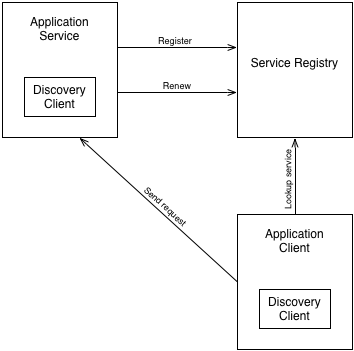

:toc:
:icons: font
:source-highlighter: prettify
:project_id: pat-service-discovery
This pattern describes how to architect service discovery for your application, enabling individually deployed services to discover each other.

== Problem

In a microservice-architected application, the individually deployed application components and services need to be able to communicate with each other, often via REST API calls. In order for any given service to make requests against another service, it must know the URL to which the service is bound. 

Unfortunately, service URLs may not be known at development or even deployment time. A service running locally during development will likely be bound to a localhost URL, whereas the same service will be bound to difference hosts when deployed in testing and production environment.

Moreoever, if there are multiple instances of any service (each bound to a unique URL), explicitly specifying a service URL precludes the possibility of load-balancing the requests from the caller.

== Solution

The solution to this problem is for each service to register itself with a service registry; consumers of the service will query the registry to discover the specifics of the service, including the service's URL, before sending requests. The service registry will report all available instances of a service, enabling the client to perform client-side load-balancing.

The Pivotal Cloud Foundry Marketplace offers the _Service Registry for Pivotal CF_ as a service for providing a registry through which services may be registered and discovered in your applications running on PCF. 

This diagram illustrates a deployment with one application service instance and one service client (which itself may also be a service). Upon startup, the application service instance registers itself with the service registry. The registry includes the service's name. The service periodically renews its registration. Should the service instance crash or otherwise be stopped, the registration will expire and the service registry will remove it.

The service client retrieves the details of the service from the service registry by name, including URL bindings for all registered instances of the service. The client then chooses an instance and sends a request to the service's URL. 

The service, client, and service registry are all deployed within Pivotal Cloud Foundry.

== Considerations

Consider the following issues when using the service registry pattern:

 * The service registry should be highly available and replicated with multiple peer instances.
 * The service registry does not perform load-balancing across service instances. Service clients should select service instances from the registry, performing a client-side load-balancing algorithm, to spread load across all service instances.
 * Services are resolved by name. Therefore, services and clients should negotiate unique and agreed upon names for distinct services.

== Usage Scenarios

The following list contains some examples regarding when to use the service discovery pattern:

* Multiple services and/or service instances need to consume each other.
* Service URL bindings vary across deployment environments.
